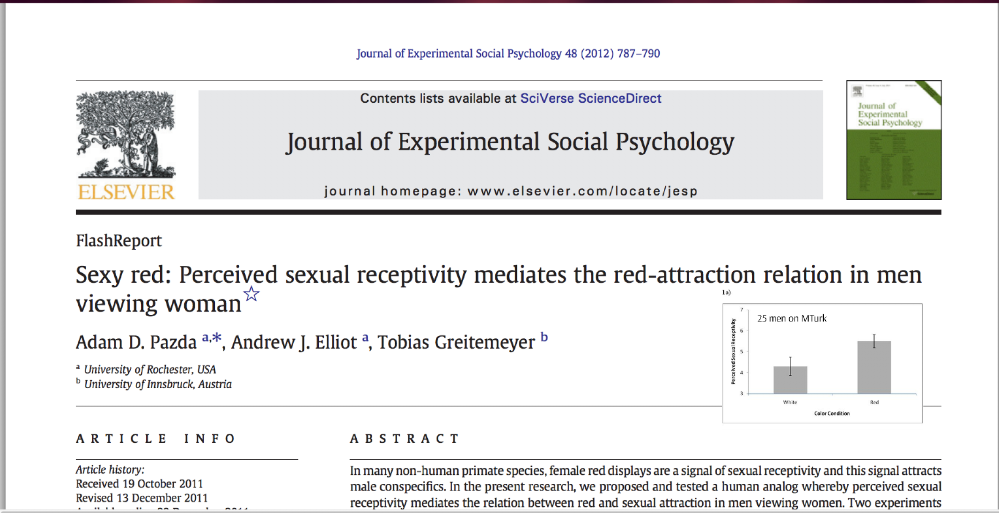
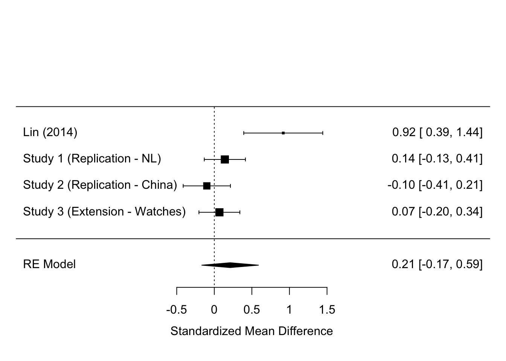

```{r setup, include=FALSE}
options(htmltools.dir.version = FALSE)
knitr::opts_chunk$set(echo = TRUE)
```

## The good, the bad and the ugly.

A semi-outside perspective. With some data interspersed between.

```{r, out.width = "600px", echo=FALSE, fig.align='center'}
knitr::include_graphics("https://media.giphy.com/media/aBktINOpjrWAE/giphy.gif") 
```

---

## Structure.

* Introduction.

* "Good"

* "Bad" leading to ... 

* "Ugly"

* What does the future hold?

--

```{r, out.width = "250px", echo=FALSE, fig.align='center'}
 # See wikipedia for attribution.
```

---
## Setting the scene...

* The fraud / replication crisis hit the Netherlands when I took up my first post at the University of Groningen.

--

* **Outsider**. I am a sociologist by training and then moved into Evolutionary Psychology, when I did my MSc. in Liverpool and then moved to Newcastle.

--

* Since then worked at various social psychology depts. in the Netherlands. And now in Northumbria University.

--

```{r, out.width = "300px", echo=FALSE, fig.align='center'}
knitr::include_graphics("https://media.giphy.com/media/98BKOjhIF4LPW/giphy.gif")
```

---
class: inverse
## The good... .

* Why things might not be as bad in Evolutionary Psychology... 

--

* That is not to say that everything is 'great'.


--

* Triangulation. (Experiments, Secondary data, Surveys, etc.)

```{r, out.width = "300px", echo=FALSE, fig.align='center'}
knitr::include_graphics("https://media.giphy.com/media/xT5LMAvRY92qUXj7dC/giphy.gif")
```

--

* More diverse samples than 'standard' social psychology.

---
## Evolutionary Psychology might do better in terms of 'broader' samples.

* Kurzban on EP Blog, found 95% of social psychology to rely on 'WEIRD' samples.

--

* We examined the 2015 volumes of 'Evolutionary Psychology' and 'Evolution and Human Behavior'.

--

* 129 papers leading to 166 samples. Majority still 'Western' (78%), but 'better than 'standard' social psychology.

---
## Samples.

```{r, out.width = "700px", echo=FALSE, fig.align='center'}

```

--

* Currently under review. You can view a preprint on OSF ([here](https://osf.io/7h24p))

---
## Ultimately crisis hould be seen as a challenge.

* Can we do better science?

--

* **Replication**: Attempt to replicate earlier findings is important but undervalued part of science.

--

* Many excellent examples, already out there. For example, work by [Lars Penke's lab](http://www.larspenke.eu/) or [Ben Jones / Lisa DeBruine](http://facelab.org/). 

--

* Work examining ovulation and sexual desire with more than 26,000 entries, 
[here](http://www.larspenke.eu/pdfs/Arslan_Schilling_Gerlach_penke_in_press_-_Ovulatory_changes_in_sexuality.pdf).

--

* My own work. Mostly via student projects. 

--

* Some examples.

---
## Age preferences.

* Replicate this paper. Can be read [here](https://docs.google.com/viewer?a=v&pid=sites&srcid=ZGVmYXVsdGRvbWFpbnx0aG9tYXN2cG9sbGV0fGd4OjdlNDY2ZTViYmUxYmE3NTg).

--

```{r, out.width = "600px", echo=FALSE, fig.align='center'}
knitr::include_graphics("Kenrick.png")
```

---
## Key findings of Kenrick et al.

** Apologies to Doug if this is a cartoonish representation of the paper... .**

--

Based on evolutionary psychology they derive the following predictions:

--

(a) younger heterosexual men will prefer women both younger and older than themselves, but older heterosexual men will only prefer women younger than themselves and specifically women in the fertile age range; 

--

(b) heterosexual women will prefer men older than themselves and show no preference for younger men; 

--

(c) homosexual men will demonstrate similar age preferences to those of heterosexual men; and 

--

(d) homosexual women will demonstrate a preference for both younger and older women.

---
## Coding of Guardian Soulmates profiles.

* N= 996

--

* Own Age, Min./Max. Age.

--

```{r, out.width = "580px", echo=FALSE, fig.align='center'}
knitr::include_graphics("soulmates-web.png")
```

---
## Key result.

```{r, out.width = "500px", echo=FALSE, fig.align='center'}
knitr::include_graphics("soulmates.png")
```
---
## Key findings.

* Both heterosexual and homosexual men prefer partners similar to their own age or younger, and with increasing age, relatively younger partners are preferred.

--

* In contrast, heterosexual women prefer partners similar to their own age or older, but at an older age younger partners are also accepted. Homosexual women prefer partners of a similar age, and with increasing age increasingly younger women are preferred.

--

--> By and large supports Kenrick et al. (1995).

--

**But**: The tolerance ranges for certain age preferences in our sample are larger than in Kenrick et al. study. Later onset of preferences for 'much younger' partners for heterosexual men in our study. Larger overall age tolerances for homosexual preferences in our study.

--

* Could also point to cultural / temporal differences.

---
## Probability of a match.


```{r, out.width = "600px", echo=FALSE, fig.align='center'}
knitr::include_graphics("guardianhits1R.png")
```

---
## Another example.

* Sex differences in mate preferences.

--

* Many famous papers (e.g., Buss 1989)

--
* Perhaps less famous: Sprecher (1994)

```{r, out.width = "500px", echo=FALSE, fig.align='center'}

```

---
## Sprecher (1994).

* long-term preferences on 12 traits.

--

* Sex differences found for all of the traits they examined with the
exception of previous marriage and different religion.

--

```{r, out.width = "300px", echo=FALSE, fig.align='center'}

```

---
## Our replication

* Published in [evolutionary psychological science](https://link.springer.com/article/10.1007/s40806-016-0048-6).

--

* 522 participants (online recruited). Same questions as in the original.

--

* 9 out of 12 tests, the direction of the effect was the same.

---
## Result: Full table

```{r, out.width = "950px", echo=FALSE, fig.align='center'}

```

--

Some highlights

---
## Some higlights

* Women more likely than men to indicate a preference for marrying someone older.

--

* Women also emphasized physical attractiveness less than men did, but valued a high earning potential more so than men did. 

--

* Men on the other hand were more willing to marry someone younger, unlikely to hold a steady job, and with low earning potential than women were.

---
class: inverse
## The Bad (and also the Ugly).

* A story on 'Red and sexual attraction'.

--

```{r, out.width = "600px", echo=FALSE, fig.align='center'}

```


---
## Color in context theory.

--

```{r, out.width = "300px", echo=FALSE, fig.align='center'}

```

--

```{r, out.width = "300px", echo=FALSE, fig.align='center'}

```

---
## Study 1.

2 x 3 Design, 206 men on campus.

--

```{r, out.width = "500px", echo=FALSE, fig.align='center'}

```

---
## Study 2.

2 x 3 Design, 190 men online.

--

```{r, out.width = "400px", echo=FALSE, fig.align='center'}

```

---
## Skeptical.

* Two failed replications of 'well-established' effect.

--

```{r, out.width = "400px", echo=FALSE, fig.align='center'}
knitr::include_graphics("https://media.giphy.com/media/3orif9K4mjshTU78SA/giphy.gif")
```


---
## Study 3: Direct replication of a published study... .

--

```{r, out.width = "400px", echo=FALSE, fig.align='center'}

```

--

```{r, out.width = "400px", echo=FALSE, fig.align='center'}

```

---
## Study 3: Findings

```{r, out.width = "600px", echo=FALSE, fig.align='center'}

```

---
## Meta-analysis.

* 27 studies, only opposite sex, manipulation of clothing/background.

--

```{r, out.width = "900px", echo=FALSE, fig.align='center'}

```

---
## Trim and fill

* Correction of _r_ =.23 (95% CI= .16 to .3) to _r_=.11 (95% CI = .04 to .19)

--

```{r, out.width = "700px", echo=FALSE, fig.align='center'}

```

---
## Meta-regression.

```{r, out.width = "600px", echo=FALSE, fig.align='center'}

```

---
## Red laptops increase attractiveness?

* At the fringes, perhaps.

--

* Red laptops increase female attractiveness as rated by men.

--

```{r, out.width = "600px", echo=FALSE, fig.align='center'}

```

---
## Two replication projects + extension.

```{r, out.width = "700px", echo=FALSE, fig.align='center'}

```

---
## Past and future replication projects.

* Other studies: 'watching eyes', risk taking and gender, ... .

* Red at the Olympics: Do red teams win more?

* Assortative preferences for eye colour.

* Rival characteristics and jealousy.

* 'High in the hierarchy'

* ... open for ideas.

---
## Take-home message.

```{r, out.width = "300px", echo=FALSE, fig.align='center'}
knitr::include_graphics("https://media.giphy.com/media/3L3SEE1rcsO1W/giphy.gif")
```

--

* It is not all doom and gloom, but we should do need to do better. (median sample size in meta-analysis on colour effects is 35 --> This translated to Cohen's _d_ of .8(!)).

--

* Strong claims, require strong data. We need better and larger samples + better use of theory.

--

* [PsySci accelerator](https://psysciacc.org/) / [Open science framework](http://osf.io)

---
##Any Questions?

[http://tvpollet.github.io](http://tvpollet.github.io)

Twitter: @tvpollet

```{r, out.width = "600px", echo=FALSE, fig.align='center'}
knitr::include_graphics("https://media.giphy.com/media/3ohzdRoOp1FUYbtGDu/giphy.gif")
```

---
##Acknowledgments

* I am greatly indebted to all [my collaborators](https://tvpollet.github.io/aboutme/) and students. (Any mistakes are my own!).

* Funded by [NWO](www.nwo.nl), [Templeton](www.templeton.org), [NIAS](http://nias.knaw.nl).

* You for listening!

```{r, out.width = "500px", echo=FALSE, fig.align='center'}
knitr::include_graphics("https://media.giphy.com/media/10avZ0rqdGFyfu/giphy.gif")
```

